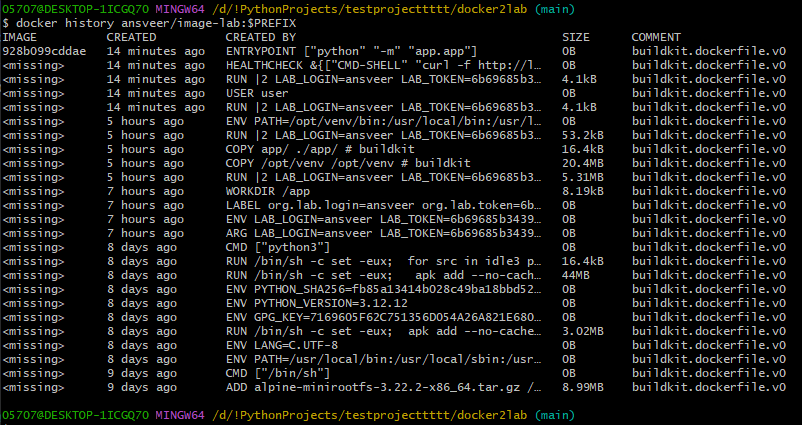

Отчёт.

Преимущества моего образа:

Размер - образ вести всего 108 MB

Имеется HEALTHCHECK, который проверяет контейнер каждые 5 секунд

Контейнер запускается под пользователем без root прав, из-за этого этот образ безопасен

Корректно завершается по SIGTERM

Можно менять переменные внутри app.py без пересборки (ROCKET_SIZE)

Вывод `docker history <login>/image-lab:<prefix>`

